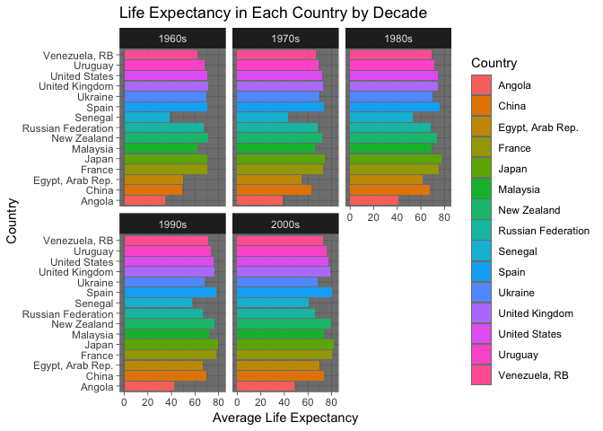

Exploring World Bank Data
================
Jess Robinson
April 29, 2019

Load necessary libraries
------------------------

``` r
#loading packages I might use 
library(tidyverse)
library(here)
library(questionr)
library(lubridate)
#trying out a new theme for this assignment
theme_set(theme_dark())
```

Write a function to import the data files
-----------------------------------------

``` r
#create function to read files
readtidy <- function(a){
#read the files, skipping the first for rows
  readfile <- read_csv(file = a, skip = 4) 
#tidying the data
     tidy <- readfile %>%
     rename(Country = "Country Name", cd = "Country Code", id = "Indicator Name",
            Indicator = "Indicator Code") %>% 
    gather(key = Year, value = values, "1960":"2016")  %>% 
    subset(select = -c(cd, id, X62)) %>% 
    spread(key = Indicator, value = values) %>%
#change years from character to integer
    mutate("Year" = as.integer(Year)) %>%
#select which variables I want to explore 
#urban population rate, GDP, life expectancy, infant mortality 
    distinct(Country, Year, EN.URB.MCTY.TL.ZS, SP.DYN.LE00.IN, NY.GDP.MKTP.KN, SP.DYN.IMRT.IN) %>%
#rename the variables
    rename(Urban = "EN.URB.MCTY.TL.ZS", LifeExp = "SP.DYN.LE00.IN", 
           GDP = "NY.GDP.MKTP.KN", InfMort="SP.DYN.IMRT.IN")
  return(tidy)
}
```

Import the data
---------------

``` r
#identify dataframes
worldbank <- dir("data_world_bank", 
          pattern = ".csv", 
          full.names = TRUE) 

#import files using an iterative operation
worldbank <- map_df(worldbank, readtidy)

#bind the data into a single frame
wb <- bind_rows(worldbank)
```

Explore the data
----------------

``` r
#add decade variable
wb <- wb %>%
  mutate(Decade = ifelse(Year %in% 1960:1969, "1960s",
        ifelse(Year %in% 1970:1979, "1970s",
        ifelse(Year %in% 1980:1989, "1980s",
        ifelse(Year %in% 1990:1999, "1990s",
        ifelse(Year %in% 2000:2009, "2000s",
        ifelse(Year %in% 2010:2016, "2010s", "N/A" )))))))

wb %>%
#filter out 2010s so I can find average by dividing by 10
filter(Decade != "2010s") %>% 
  mutate(AGDP = GDP/10) %>%
  #plot GDP by decade
  ggplot(mapping = aes(x = Decade , y = AGDP, fill = Decade)) +
  geom_col() +
  labs(title = "Average Gross Domestic Product by Decade", 
  x = "Decade", 
  y = "Average Gross Domestic Product",
  color = "Decade")
```


The plot above shows the average Gross Domestic product of all fifteen countries from 1960 to 2009. We can see a strong positive correlation between later decades and an increase in overall GDP.

``` r
#plot percent urban population vs. life expectancy by country
wb %>%
  ggplot(mapping = aes(x = Urban, y = LifeExp, color = Country)) +
  geom_point() +
  labs(title = "Population in Urban Areas and Life Expectancy", 
  x = "Percent of Population Living in Urban Areas", 
  y = "Life Expectancy",
  color = "Country")
```


This plot shows that, for most countries in this dataset, as the rates of people living in urban areas increases, so too does the average life expectancy.

``` r
#plot percent infant mortality vs. life expectancy by country
wb %>%
  ggplot(mapping = aes(x = LifeExp, y = InfMort, color = Country)) +
  geom_point() +
  labs(title = "Life Expectancy and Infant Mortality", 
  x = "Life Expectancy", 
  y = "Infant Mortality",
  color = "Country")
```


The plot shows that, for most of the countries in this dataset, there is a strong negative correlation between life expectancy and infant mortality rate. That is, when the average life expectancy goes up, the infant mortality rate goes down.

``` r
wb %>% 
#filter out 2010s so I can find average by dividing by 10
  filter(Decade != "2010s") %>%
  mutate(ALE = LifeExp/10) %>%
#plot avg. life expectancy each decade by country
  ggplot(mapping = aes(x = Country , y = ALE, fill = Country)) +
  geom_col() +
  facet_wrap(~ Decade) +
  labs(title = "Life Expectancy in Each Country by Decade", 
  x = "Country", 
  y = "Average Life Expectancy") +
  coord_flip()
```



The chart above shows the average life expectancy in each country in the data set by decade. This shows that, on average, the the life expectancy went up each decade. However, this also demonstrates that country is a larger factor in life expectancy than decade, rates over each decade tend to stay relatively similar, increasing only slightly compared to overall variance in life expectancy.

Session info
------------

``` r
devtools::session_info()
```

    ## ─ Session info ──────────────────────────────────────────────────────────
    ##  setting  value                       
    ##  version  R version 3.5.0 (2018-04-23)
    ##  os       OS X El Capitan 10.11.6     
    ##  system   x86_64, darwin15.6.0        
    ##  ui       X11                         
    ##  language (EN)                        
    ##  collate  en_US.UTF-8                 
    ##  ctype    en_US.UTF-8                 
    ##  tz       America/Chicago             
    ##  date     2019-04-29                  
    ## 
    ## ─ Packages ──────────────────────────────────────────────────────────────
    ##  package     * version date       lib source        
    ##  assertthat    0.2.0   2017-04-11 [1] CRAN (R 3.5.0)
    ##  backports     1.1.2   2017-12-13 [1] CRAN (R 3.5.0)
    ##  base64enc     0.1-3   2015-07-28 [1] CRAN (R 3.5.0)
    ##  bindr         0.1.1   2018-03-13 [1] CRAN (R 3.5.0)
    ##  bindrcpp    * 0.2.2   2018-03-29 [1] CRAN (R 3.5.0)
    ##  broom         0.5.0   2018-07-17 [1] CRAN (R 3.5.0)
    ##  callr         3.0.0   2018-08-24 [1] CRAN (R 3.5.0)
    ##  cellranger    1.1.0   2016-07-27 [1] CRAN (R 3.5.0)
    ##  cli           1.0.0   2017-11-05 [1] CRAN (R 3.5.0)
    ##  colorspace    1.3-2   2016-12-14 [1] CRAN (R 3.5.0)
    ##  crayon        1.3.4   2017-09-16 [1] CRAN (R 3.5.0)
    ##  desc          1.2.0   2018-05-01 [1] CRAN (R 3.5.0)
    ##  devtools      2.0.1   2018-10-26 [1] CRAN (R 3.5.0)
    ##  digest        0.6.15  2018-01-28 [1] CRAN (R 3.5.0)
    ##  dplyr       * 0.7.6   2018-06-29 [1] CRAN (R 3.5.1)
    ##  evaluate      0.10.1  2017-06-24 [1] CRAN (R 3.5.0)
    ##  forcats     * 0.3.0   2018-02-19 [1] CRAN (R 3.5.0)
    ##  fs            1.2.6   2018-08-23 [1] CRAN (R 3.5.0)
    ##  ggplot2     * 3.0.0   2018-07-03 [1] CRAN (R 3.5.0)
    ##  glue          1.2.0   2017-10-29 [1] CRAN (R 3.5.0)
    ##  gtable        0.2.0   2016-02-26 [1] CRAN (R 3.5.0)
    ##  haven         2.1.0   2019-02-19 [1] CRAN (R 3.5.2)
    ##  here        * 0.1     2017-05-28 [1] CRAN (R 3.5.0)
    ##  highr         0.7     2018-06-09 [1] CRAN (R 3.5.0)
    ##  hms           0.4.2   2018-03-10 [1] CRAN (R 3.5.0)
    ##  htmltools     0.3.6   2017-04-28 [1] CRAN (R 3.5.0)
    ##  httpuv        1.4.4.2 2018-07-02 [1] CRAN (R 3.5.0)
    ##  httr          1.3.1   2017-08-20 [1] CRAN (R 3.5.0)
    ##  jsonlite      1.5     2017-06-01 [1] CRAN (R 3.5.0)
    ##  knitr         1.20    2018-02-20 [1] CRAN (R 3.5.0)
    ##  labeling      0.3     2014-08-23 [1] CRAN (R 3.5.0)
    ##  later         0.7.3   2018-06-08 [1] CRAN (R 3.5.0)
    ##  lattice       0.20-35 2017-03-25 [1] CRAN (R 3.5.0)
    ##  lazyeval      0.2.1   2017-10-29 [1] CRAN (R 3.5.0)
    ##  lubridate   * 1.7.4   2018-04-11 [1] CRAN (R 3.5.0)
    ##  magrittr      1.5     2014-11-22 [1] CRAN (R 3.5.0)
    ##  memoise       1.1.0   2017-04-21 [1] CRAN (R 3.5.0)
    ##  mime          0.5     2016-07-07 [1] CRAN (R 3.5.0)
    ##  miniUI        0.1.1.1 2018-05-18 [1] CRAN (R 3.5.0)
    ##  modelr        0.1.2   2018-05-11 [1] CRAN (R 3.5.0)
    ##  munsell       0.5.0   2018-06-12 [1] CRAN (R 3.5.0)
    ##  nlme          3.1-137 2018-04-07 [1] CRAN (R 3.5.0)
    ##  pillar        1.2.3   2018-05-25 [1] CRAN (R 3.5.0)
    ##  pkgbuild      1.0.2   2018-10-16 [1] CRAN (R 3.5.0)
    ##  pkgconfig     2.0.1   2017-03-21 [1] CRAN (R 3.5.0)
    ##  pkgload       1.0.2   2018-10-29 [1] CRAN (R 3.5.0)
    ##  plyr          1.8.4   2016-06-08 [1] CRAN (R 3.5.0)
    ##  prettyunits   1.0.2   2015-07-13 [1] CRAN (R 3.5.0)
    ##  processx      3.2.0   2018-08-16 [1] CRAN (R 3.5.0)
    ##  promises      1.0.1   2018-04-13 [1] CRAN (R 3.5.0)
    ##  ps            1.1.0   2018-08-10 [1] CRAN (R 3.5.0)
    ##  purrr       * 0.2.5   2018-05-29 [1] CRAN (R 3.5.0)
    ##  questionr   * 0.7.0   2018-11-26 [1] CRAN (R 3.5.0)
    ##  R6            2.2.2   2017-06-17 [1] CRAN (R 3.5.0)
    ##  Rcpp          0.12.17 2018-05-18 [1] CRAN (R 3.5.0)
    ##  readr       * 1.1.1   2017-05-16 [1] CRAN (R 3.5.0)
    ##  readxl        1.1.0   2018-04-20 [1] CRAN (R 3.5.0)
    ##  remotes       2.0.2   2018-10-30 [1] CRAN (R 3.5.0)
    ##  rlang         0.3.0.1 2018-10-25 [1] CRAN (R 3.5.0)
    ##  rmarkdown     1.10    2018-06-11 [1] CRAN (R 3.5.0)
    ##  rprojroot     1.3-2   2018-01-03 [1] CRAN (R 3.5.0)
    ##  rstudioapi    0.8     2018-10-02 [1] CRAN (R 3.5.0)
    ##  rvest         0.3.2   2016-06-17 [1] CRAN (R 3.5.0)
    ##  scales        0.5.0   2017-08-24 [1] CRAN (R 3.5.0)
    ##  sessioninfo   1.1.1   2018-11-05 [1] CRAN (R 3.5.0)
    ##  shiny         1.1.0   2018-05-17 [1] CRAN (R 3.5.0)
    ##  stringi       1.2.3   2018-06-12 [1] CRAN (R 3.5.0)
    ##  stringr     * 1.3.1   2018-05-10 [1] CRAN (R 3.5.0)
    ##  testthat      2.0.0   2017-12-13 [1] CRAN (R 3.5.0)
    ##  tibble      * 1.4.2   2018-01-22 [1] CRAN (R 3.5.0)
    ##  tidyr       * 0.8.1   2018-05-18 [1] CRAN (R 3.5.0)
    ##  tidyselect    0.2.4   2018-02-26 [1] CRAN (R 3.5.0)
    ##  tidyverse   * 1.2.1   2017-11-14 [1] CRAN (R 3.5.0)
    ##  usethis       1.4.0   2018-08-14 [1] CRAN (R 3.5.0)
    ##  withr         2.1.2   2018-03-15 [1] CRAN (R 3.5.0)
    ##  xml2          1.2.0   2018-01-24 [1] CRAN (R 3.5.0)
    ##  xtable        1.8-2   2016-02-05 [1] CRAN (R 3.5.0)
    ##  yaml          2.1.19  2018-05-01 [1] CRAN (R 3.5.0)
    ## 
    ## [1] /Library/Frameworks/R.framework/Versions/3.5/Resources/library
